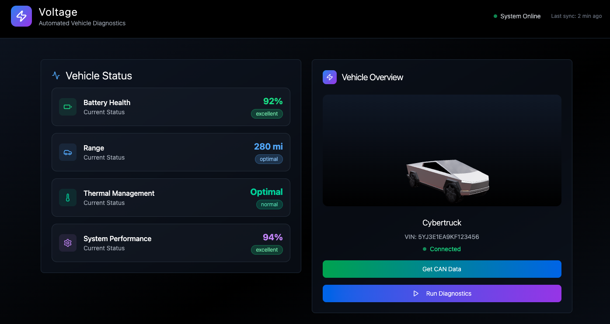
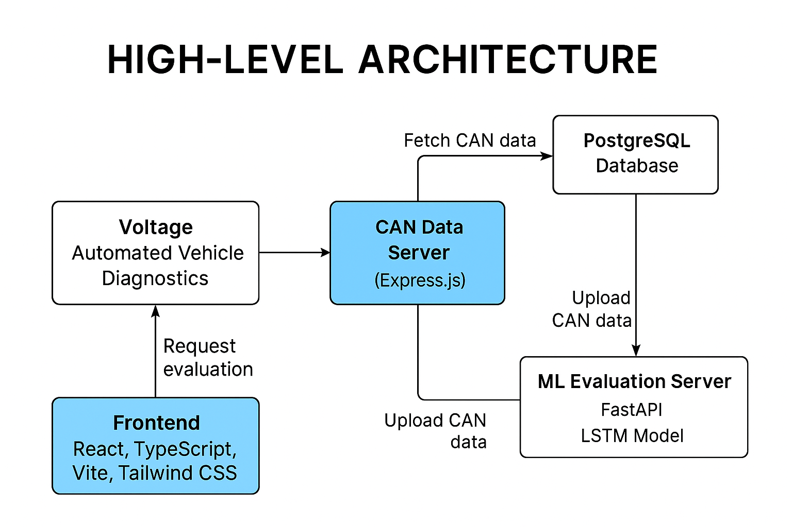

# Voltage: Automated Vehicle Diagnostics




## 1. Motivation & Scope

Connected and autonomous vehicles (CAVs) generate vast streams of CAN-bus data that must be continuously monitored to ensure safety and reliability. Voltage is an end-to-end platform that:

1. **Ingests** raw CAN logs via a lightweight Express service with PostgreSQL-backed metadata.
2. **Analyzes** them using a dedicated FastAPI ML server running a PyTorch LSTM autoencoder for time-series anomaly detection.
3. **Visualizes** real-time vehicle health and anomalies in a React + TypeScript + Tailwind UI.

By separating concerns, we ensure each component can be scaled, tested, and maintained independently. This architecture addresses real-world CAV challenges, bridging research insights with practical deployment.

---

## 2. System Architecture
```text
[ Frontend (React) ]   (1) GET /can-logs  →   [ CAN Data Server (Express + PostgreSQL) ]   (2) GET /can-logs/:id → CSV  →   [ ML Server (FastAPI + PyTorch) ]  (3) POST /evaluate → JSON Anomalies
```

* **Express + PostgreSQL (CAN Data Server)**

  * Stores metadata in a `can_logs` table and streams CSV files as needed.
  * Parameterized SQL queries prevent injection.
  * Streams large CSVs with `fs.createReadStream()`, avoiding memory overload.
  * Scales horizontally behind a load balancer.

* **FastAPI + PyTorch (ML Server)**

  * Loads a pre-trained LSTM autoencoder checkpoint for inference.
  * Asynchronous handling via Uvicorn allows concurrent inference requests .
  * Provides auto-generated OpenAPI docs at `/docs`.
  * Can be deployed on GPU-enabled instances for faster inference.

* **React + TypeScript + Tailwind (Frontend)**

  * Fetches metadata and CSVs from the CAN Data Server, retains the CSV in memory as a Blob, then posts it to the ML Server.
  * Renders real-time diagnostics, 3D vehicle visualization, and anomaly results.
  * Rapid development with Vite and type safety with TypeScript .

---

## 3. Frontend (React + TypeScript + Tailwind)

### 3.1. Tech Stack Rationale

* **React**: Component-based architecture with virtual DOM for efficient updates in a real-time dashboard context.
* **TypeScript**: Compile-time type checking improves maintainability and reduces runtime errors in a large codebase.
* **TailwindCSS**: Utility-first approach enables rapid, consistent styling without writing custom CSS rules.
* **Vite**: Provides near-instant cold starts and fast Hot Module Replacement (HMR) for a superior development experience.

### 3.2. Directory Structure

```
frontend/
├── src/
│   ├── components/         # Reusable UI components (FileUploader, AnomalyTable, Vehicle3D)
│   ├── pages/              # Top-level pages (Home, Diagnostics)
│   ├── services/           # API clients for /can-logs (Express) and /evaluate (FastAPI)
│   ├── App.tsx             # Root component with React Router
│   └── index.tsx           # Entry point
├── public/
│   └── index.html          # HTML template
├── tailwind.config.js      # Tailwind configuration
├── vite.config.ts          # Vite configuration
└── package.json            # Dependencies and scripts
```

### 3.3. Key Features

* **Real-time vehicle status and diagnostics** pulled from the ML inference results.
* **3D vehicle visualization** (e.g., Three.js) displaying sensor anomalies overlayed on a vehicle model.
* **File upload/download**: CAN CSVs are fetched from the CAN Data Server and then passed to the ML Server for inference.
* **Anomaly results display**: A table or chart showing flagged windows with timestamps.

### 3.4. Running Locally

```bash
cd frontend
npm install
npm run dev
```

Visit `http://localhost:8080` (or the port specified by Vite).

---

## 4. CAN Data Server (Express + PostgreSQL)

### 4.1. Tech Stack Rationale

* **Express.js**: Minimalistic, middleware-driven framework well-suited for REST APIs and static file streaming.
* **PostgreSQL**: Robust RDBMS offering ACID compliance and indexing for efficient log metadata queries.
* **Parameterized SQL** using `pg` prevents SQL injection and ensures secure data access.
* **File streaming** with `fs.createReadStream()` handles large CSVs without exhausting memory.

### 4.2. Database Schema & Migration

* **Table: `can_logs`**

  ```sql
  CREATE TABLE IF NOT EXISTS can_logs (
    id SERIAL PRIMARY KEY,
    filename VARCHAR(255) NOT NULL UNIQUE,
    description TEXT,
    uploaded_at TIMESTAMPTZ DEFAULT NOW()
  );
  ```

### 4.3. API Endpoints

1. **`GET /can-logs`**

   * **Query Params**: `limit` (int, default=100), `offset` (int, default=0) for pagination.
   * **Response (200)**: JSON array of logs:

     ```json
     [
       { "id":1, "filename":"dummy1.csv", "description":"Test log 1", "uploaded_at":"2025-06-01T12:00:00Z" },
       ...
     ]
     ```
   * **Errors (500)**: Database unreachable.

2. **`GET /can-logs/:id`**

   * **Params**: `id` (int).
   * **Response (200)**: Streams the CSV file.

     * Headers: `Content-Type: text/csv`, `Content-Disposition: attachment; filename="<filename>"`
   * **Errors**:

     * `400` if `id` is invalid.
     * `404` if no DB record or file missing on disk.

3. **`POST /can-logs`**

   * **Body (application/json)**: `{ "filename":"dummy3.csv", "description":"Test log 3" }`
   * **Response (201)**: JSON of new record:

     ```json
     { "id":3, "filename":"dummy3.csv", "description":"Test log 3", "uploaded_at":"2025-06-02T08:00:00Z" }
     ```
   * **Errors**:

     * `400` if `filename` missing.
     * `404` if file not found in `data/can_logs/`.
     * `409` if `filename` already exists in DB.

### 4.4. Project Structure

```
backend/can_data_server/
├── config/
│   └── db.js              # PostgreSQL connection pool (pg + dotenv)
├── controllers/
│   └── canLogsController.js  # Route handlers for /can-logs
├── data/
│   └── can_logs/          # Place CSVs here (dummy1.csv, dummy2.csv, ...)
├── middleware/
│   └── errorHandler.js    # Centralized error handling
├── migrations/
│   └── 001_create_can_logs_table.sql
├── models/
│   └── canLogModel.js     # Data-access methods using parameterized SQL
├── routes/
│   └── canLogsRoutes.js   # Express router for /can-logs endpoints
├── .env                   # Environment variables (not committed)
├── .gitignore
├── app.js                 # Main Express application
├── package.json
└── README.md              # This project README
```

### 4.5. Running Locally

1. Ensure PostgreSQL is running and `.env` contains correct `PGHOST`, `PGUSER`, `PGPASSWORD`, `PGDATABASE`, `PGPORT`.
2. Run migrations:

   ```bash
   export $(cat .env | xargs)
   psql "$PGDATABASE" --host="$PGHOST" --username="$PGUSER" --port="$PGPORT" -f migrations/001_create_can_logs_table.sql
   ```
3. Install dependencies and start server:

   ```bash
   cd backend/can_data_server
   npm install
   npm run lint         # ESLint checks
   node app.js
   ```

Server listens on `http://localhost:3000`.

---

## 5. ML Evaluation Server (FastAPI + PyTorch)

### 5.1. Tech Stack Rationale

* **FastAPI**: Async framework with built-in data validation (Pydantic) and auto-generated OpenAPI docs at `/docs`. Ideal for ML inference endpoints .
* **PyTorch**: Provides dynamic graph LSTM modeling and GPU acceleration for real-time anomaly detection.
* **Uvicorn**: ASGI server that efficiently handles many concurrent requests.

### 5.2. Model Overview & Training

* **Architecture**: LSTM autoencoder with:

  * Encoder: 2-layer LSTM (hidden\_dim=128) compressing a 50×8 window to a 32-dim bottleneck.
  * Decoder: 2-layer LSTM reconstructing the 50×8 sequence.
* **Training** (`ml/train_lstm.py`):

  * Batch size = 64, LR = 1e-3, epochs = \~50.
  * Uses Adam optimizer, MSE loss on pure "normal" CAN windows.
  * Saves `model_checkpoint.pth`, `norm_params.npz`, `threshold.pt` (threshold = `mean_error + 3*std_error` on validation set).

### 5.3. API Endpoint

1. **`POST /evaluate`**

   * **Consumes**: `multipart/form-data`
   * **Form Data**: `file`: CSV (MIME type `text/csv`. Max size configurable)
   * **Process**:

     1. Load normalization params (`data_min`, `data_max`) and `threshold.pt` at startup.
     2. Normalize incoming CSV rows: `(x - data_min)/(data_max - data_min + 1e-6)`.
     3. Create sliding windows (length = seq\_length).
     4. Batch inference with PyTorch (batch size = 64).
     5. Compute per-window MSE; compare to threshold.
   * **Response (200)**:

     ```json
     {
       "total_windows": 1234,
       "num_anomalies": 45,
       "anomalies": [
         { "window_index": 12, "start_row": 12, "timestamp": "2025-06-02T08:00:00Z" },
         ...
       ]
     }
     ```
   * **Errors**:

     * `400` if no file or CSV malformed.
     * `500` if inference fails.

### 5.4. Project Structure

```
backend/ml_eval_server/
├── models/                # Pre-trained model files: model_checkpoint.pth, norm_params.npz, threshold.pt
├── ml/                    # Training & utility scripts (train_lstm.py, evaluate_lstm.py)
├── server_main.py         # FastAPI application (loading model, /evaluate endpoint)
├── requirements.txt       # Python dependencies pinned to versions
├── Dockerfile             # (optional) for containerizing ML server
└── README.md              # ML server–specific README notes
```

### 5.5. Running Locally

```bash
cd backend/ml_eval_server
python3 -m venv venv
source venv/bin/activate
pip install -r requirements.txt
uvicorn server_main:app --reload --port 8000
```

Visit `http://localhost:8000/docs` for interactive API docs.

---

## 6. Contributing & Development Workflow

1. **Fork & Clone**:

   ```bash
   git clone https://github.com/harismalik-1/voltage-car-diagnostics.git
   cd voltage-car-diagnostics
   ```

2. **CAN Data Server Setup**:

   ```bash
   cd backend/can_data_server
   npm install
   # Load environment vars from .env
   export $(cat .env | xargs)
   # Run migrations (Postgres must be running)
   psql "$PGDATABASE" --host="$PGHOST" --username="$PGUSER" --port="$PGPORT" -f migrations/001_create_can_logs_table.sql
   npm run lint        # ESLint checks
   node app.js         # Starts at http://localhost:3000
   ```

3. **ML Server Setup**:

   ```bash
   cd backend/ml_eval_server
   python3 -m venv venv
   source venv/bin/activate
   pip install -r requirements.txt
   pytest               # Run PyTest suite
   flake8 .             # Lint
   uvicorn server_main:app --reload --port 8000
   ```

   Visit `http://localhost:8000/docs` for API docs.

4. **Frontend Setup**:

   ```bash
   cd frontend
   npm install
   npm run lint         # ESLint + TypeScript checks
   npm run dev          # Starts at http://localhost:8080
   ```

5. **Register a New CAN Log**:

   * Copy `my_log.csv` into `backend/can_data_server/data/can_logs/`.
   * POST to Express:

     ```bash
     curl -X POST http://localhost:3000/can-logs \
       -H "Content-Type: application/json" \
       -d '{"filename":"my_log.csv","description":"Production test log"}'
     ```
   * Confirm that `GET /can-logs` now lists `my_log.csv`.

6. **Train a New ML Model**:

   ```bash
   cd backend/ml_eval_server
   source venv/bin/activate
   python ml/train_lstm.py
   ```

   * Confirm that `models/model_checkpoint.pth`, `norm_params.npz`, and `threshold.pt` are updated.

7. **Open a Pull Request**:

   * Create a feature branch: `git checkout -b feature/<your-feature>`
   * Commit incrementally with clear messages.
   * Push to your fork and open a PR against `main`.
   * Ensure CI checks pass, tests are green, and a reviewer approves.

---
